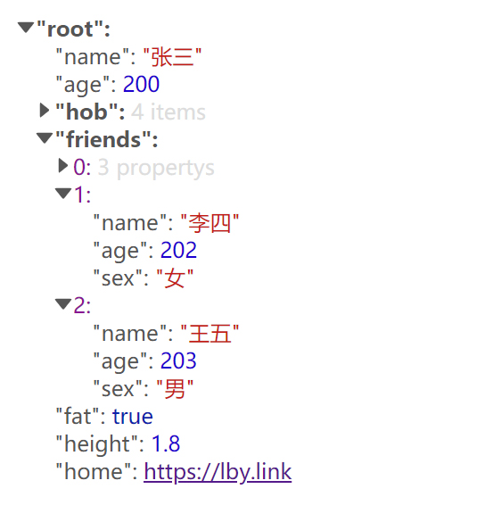

# vue-json-tree-viewer

> json tree viewer component

## Installation

Install the plugin with npm:

~~~
npm install -S vue-json-tree-viewer
~~~

 Then

~~~
import JsonTreeViewer from "vue-json-tree-viewer"
Vue.use(JsonTreeViewer)
~~~

## Usage

Use in your Vue component.

~~~html

    <JsonTreeViewer
      v-model="jsonData"
      :options="options"
    />

~~~
## Props

##### `viewData `

JSON object data to be displayed

##### `options`

Configuration related parameters 

See at:

~~~~json
{
        defaultOpen:true,
        rootKeyName:"root",
        editable:false,
        styles:{},
        parseLink:true
      }
~~~~

Options Detail:

| attribute   | required | default | type    | explain                             |
| ----------- | -------- | ------- | ------- | ----------------------------------- |
| defaultOpen | false    | true    | Boolean | Expand by default                   |
| rootKeyName | false    | root    | String  | The JSON tree root name             |
| editable    | false    | false   | Boolean | Whether the json tree can be edited |
| styles      | false    | {}      | Object  | Some styles...                      |
| parseLink   | false    | true    | Boolean | Whether to parse text links         |
|             |          |         |         |                                     |

:white_check_mark:collapse json tree

:white_check_mark:parse text links

:x: custom styles  (feature ) 

:x:editable json tree data(feature)

## Event

##### `update` 

:x:  Triggered when json tree data is updated(feature)