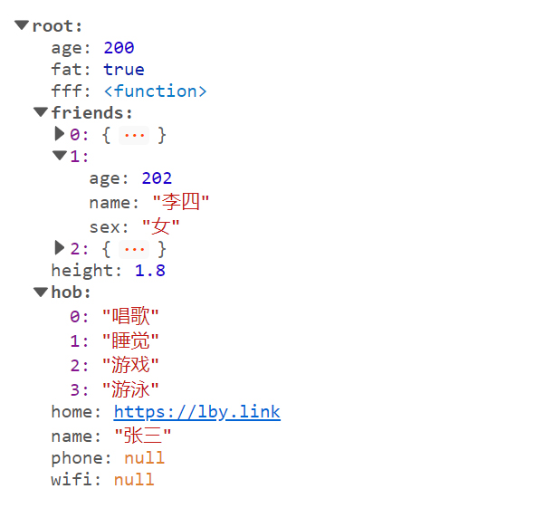

# vue-json-tree-viewer

> json tree viewer component , Customized color matching can be realized.



## Installation

Install the plugin with npm:

```
npm install -S vue-json-tree-viewer
```

Then

```
import JsonTreeViewer from "vue-json-tree-viewer"
Vue.use(JsonTreeViewer)
```

## Usage

Use in your Vue component.

```html
<div id="app">
  <JsonTreeViewer ：value="jsonData" :options="options" />
</div>
```

## Props

##### `value`

JSON object data to be displayed

##### `options`

Configuration related parameters

See at:

```json
{
  defaultOpen: true, // default extend
  rootKeyName: 'root', // root key name
  sortable: false, // sortable for key
  defaultOpenDepth: 1, // default extend max depth
  styles: { // Text color
    key: { // key text color
      string: '#555',
      number: '#881391'
    },
    value: {// value text color
      string: '#c41a16',
      number: ' #1c00cf',
      boolean: '#0d22aa',
      null: '#e08331',
      undefined: '#e08331',
      function: '#067bca'
    }
  },
  parseLink: true, // Parsing text link
  keyNameQuote: false, // The key name quote  value: false / single / double
  valueNameQuote: 'double', //  single / double
  hints: { // Prompt when folding word
    array: ['item', 'items'],
    object: ['property', 'propertys']
  }
}
```

Options Detail:

| attribute        | required | default | type             | explain                                            |
| ---------------- | -------- | ------- | ---------------- | -------------------------------------------------- |
| defaultOpen      | false    | true    | Boolean          | Expand by default                                  |
| rootKeyName      | false    | root    | String           | The JSON tree root name                            |
| editable         | false    | false   | Boolean          | Whether the json tree can be edited                |
| styles           | false    | {}      | Object           | Some styles...                                     |
| parseLink        | false    | true    | Boolean          | Whether to parse text links                        |
| hints            | false    | {}      | Object           | placeholder hints                                  |
| defaultOpenDepth | false    | 1       | Number           | max default open depth                             |
| keyNameQuote     | false    | double  | Boolean / String | The key name quote ,value: false / single / double |
| valueNameQuote   | false    | double  | String           | The key name quote , value:  single / double       |


#### styles:

> custom  your theme colors ( key / value)

~~~json
  styles: { // Text color
    key: { // key text color
      string: '#555',
      number: '#881391'
    },
    value: {// value text color
      string: '#c41a16',
      number: ' #1c00cf',
      boolean: '#0d22aa',
      null: '#e08331',
      undefined: '#e08331',
      function: '#067bca'
    }
  }
~~~

#### hints:

> set placeholder at collapse

~~~json
hints: { // Prompt when folding word
    array: ['item', 'items'],
    object: ['property', 'propertys']
  }
~~~


---


:white_check_mark:collapse json tree

:white_check_mark:parse text links

:white_check_mark: custom styles 

:x:editable json tree data(feature)

## Event

##### `update`

:x: Triggered when json tree data is updated(feature)
